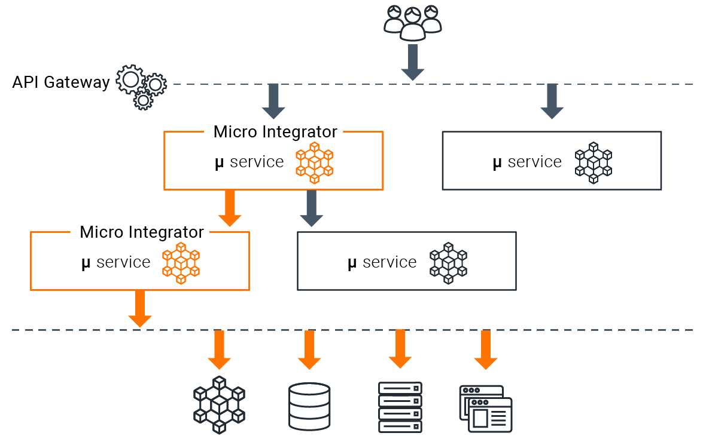

# WSO2 Micro Integrator

[](https://wso2.org/jenkins/job/products/job/micro-integrator/)
[](https://opensource.org/licenses/Apache-2.0)
[](https://stackoverflow.com/questions/tagged/wso2-micro-integrator)
[](https://discord.gg/wso2)
[](https://twitter.com/intent/follow?screen_name=wso2)

[WSO2 Micro Integrator](https://wso2.com/micro-integrator/) is a comprehensive integration solution that simplifies your digital transformation journey. The Micro Integrator streamlines connectivity among applications, services, data, and the cloud using a user-friendly, low-code graphical design experience.

Refer to the [official documentation](https://mi.docs.wso2.com/en/latest/get-started/introduction) for further information.

The Micro Integrator runtime is lightweight, fast, scalable, and supports centralized ESB-style integration architectures as well as decentralized microservices architectures:

-   Centralized integration architecture
  

-   Decentralized integration architecture
  

Developers can create integrations graphically by using [WSO2 Micro Integrator for Visual Studio Code extension (MI for VSCode)](https://marketplace.visualstudio.com/items?itemName=WSO2.micro-integrator) and deploy them in the Micro Integrator runtime.

## Summary

- [**Why Micro Integrator?**](#why-micro-integrator?)
- [**Getting Started**](#getting-started)
- [**Contributing**](#contributing)
- [**Licence**](#licence)
- [**Copyright**](#copyright)

## Why Micro Integrator?

The Micro Integrator provides developers with a flawless experience in developing, testing, and deploying integration solutions. The Micro Integrator developer experience is specially tuned for;
-   Integration developers who prefer a config-driven approach to integration (centralized or decentralized).
-   Integration developers who are looking for a solution to integrate brownfield (i.e. legacy systems) solutions with new microservices-based solutions.
-   Existing WSO2 EI and integration middleware users who want to move into cloud-native or microservices architectures.

The Micro Integrator offers an enhanced experience for container-based architectures by simplifying Docker/Kubernetes deployments. 

Refer to the [Developing Integration Solutions](https://mi.docs.wso2.com/en/latest/develop/intro-integration-development/) documentation for information.

## Getting Started

See the following topics to get started with the product:
- [Install and Setup](https://mi.docs.wso2.com/en/latest/install-and-setup/install/installation-prerequisites/) the Micro integrator
- [Quick Start Guide](https://mi.docs.wso2.com/en/latest/get-started/quick-start-guide/)

See the [Tutorials and Examples](https://mi.docs.wso2.com/en/latest/learn/learn-overview/) to try out the main integration use cases. You can also find more resources in the [WSO2 Library](https://wso2.com/library/?product=integration).

## Contributing

If you are planning to contribute to the development efforts of WSO2 Micro Integrator, you can do so by checking out
the latest development version. The `master` branch holds the latest unreleased source code.

### Building from the source

Please follow the steps below to build WSO2 Micro Integrator from the source code.

1. Clone or download the source code from this repository (https://github.com/wso2/micro-integrator).
2. Run the maven command `mvn clean install` from the root directory of the repository.
3. The generated Micro Integrator distribution can be found at `micro-integrator/distribution/target/wso2mi-<version>.zip`.

Please note that the product can be build using only JDK 11 but the integration tests can be run in either JDK 11, 17 or 21.

#### Building the Docker image

You can build the Docker image for the Micro Integrator by setting the `docker.skip` system property to `false` when running the
Maven build. This builds and pushes the micro-integrator Docker image to the local Docker registry.

```bash
mvn clean install -Ddocker.skip=false
```

## License

WSO2 Micro Integrator is licensed under the [Apache License](http://www.apache.org/licenses/LICENSE-2.0).

## Survey On Open Source Community Communication

WSO2 wants to learn more about our open source software (OSS) community and your communication preferences to serve you better.

In addition, we may reach out to a small number of respondents to ask additional questions and offer a small gift.

Link to survey: https://forms.gle/h5q4M3K7vyXba3bK6

## Copyright

(c) 2020, [WSO2 Inc.](http://www.wso2.org) All Rights Reserved.
