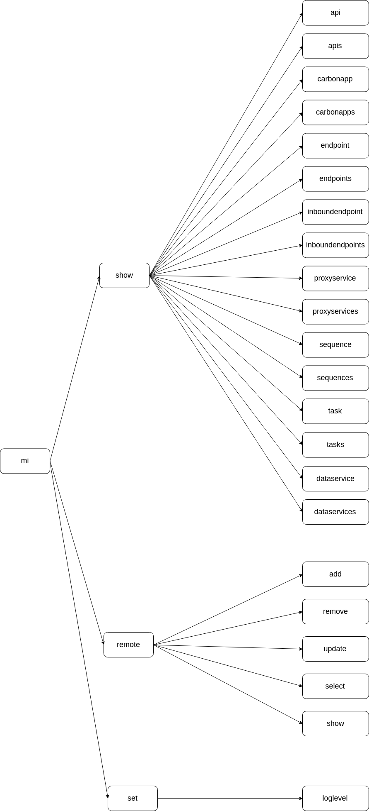

## WSO2 Micro Integrator CLI Commands



### Available commands

#### show
```
show api(s) <apiname>
show carbonapp(s) <appname>
show endpoint(s) <endpointname>
show inboundendpoint(s) <endpointname>
show proxyservice(s) <proxyname>
show sequence(s) <sequencename>
show task(s) <taskname>
show dataservice(s) <dataservicename>
```

#### remote
```
remote add [nick-name] [host] [port]
remote remove [nick-name]
remote update [nick-name] [host] [port]
remote select [nick-name]
remote show
```

#### set
```
set loglevel [logger-name] [logging-level]
set loglevel [logging-level]
remote show
```