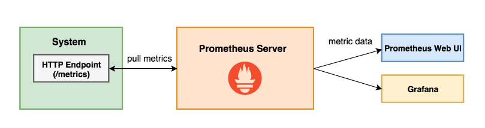

# Working with the Micro Integrator

The Micro Integrator is designed in a highly container-friendly manner, and thereby, it is ideal for you to use it for
Microservices Architecture (MSA)-based solutions, which are deployed in container-based environments. Because its
start-up time is faster than the ESB profile, the Micro Integrator profile allows you to perform advanced integration
scenarios without sacrificing the speed required for a container-based deployment architecture.

For information on what the Micro Integrator profile brings with this release, see
[releases](https://github.com/wso2/micro-integrator/releases).

## Folder Structure of the distribution

```
.
├── bin
│   ├── micro-integrator.bat
│   ├── micro-integrator.sh
|   |
├── conf
│   ├── access-log.properties
│   ├── axis2
|   |    ├── axis2_blocking_client.xml
|   |    ├── axis2_client.xml
|   |    └── axis2.xml
|   |
│   ├── carbon.xml
│   ├── datasources
|   |     └── master-datasources.xml
|   |
│   ├── log4j.properties
│   ├── passthru-http.properties
│   ├── security
│   ├── synapse-handlers.xml
│   ├── synapse.properties
│   └── wso2-log-masking.properties
|
├── dbscripts
|
├── dockerfiles
|    ├── Dockerfile
│    └── files
|  
├── dropins
|
├── lib
|
├── LICENSE.txt
|
├── patches
|
├── README.txt
|
├── registry
|
├── release-notes.html
|
├── repository 
|   ├── database
|   │   
|   ├── deployment
|   │   ├── client
|   │   │   ├── modules
|   │   │       
|   │   └── server
|   │       ├── axis2modules
|   │       │   
|   │       ├── axis2services
|   │       │   
|   │       ├── carbonapps
|   │       │   
|   │       ├── synapse-configs
|   │       │   
|   │       └── webapps
|   ├── logs
|   │   ├── audit.log
|   │   ├── http_access_management_console_2019-05-01.log
|   │   ├── patches.log
|   │   ├── tm.out
|   │   ├── wso2carbon.log
|   │   ├── wso2carbon-trace-messages.log
|   │   ├── wso2-ei-service.log
|   │   ├── wso2-ei-trace.log
|   │   └── wso2error.log
|   ├── resources
|       └── security
|
├── tmp
|
├── updates
|
└── wso2
    ├── components
    └── lib

```
- **bin** 
  - **micro-integrator.sh** - script used to start the micro-integrator in Linux/Mac OS
  - **micro-integrator.bat** - windows executable used to run micro-integrator
- **conf** 
  - **access-log.properties** - used to customize the format of the [Access Logs](https://docs.wso2.com/display/EI6xx/Monitoring+Access+Logs) 
  - **axis2**
    - **axis2_blocking_client.xml** - contains parameters which apply to scenarios where blocking transports
    - **axis2_client.xml** - used in creating the configuration context by the FE server calling to BE server
    - **axis2.xml** - can be used to change the default functionality-related configurations [related doc](https://docs.wso2.com/display/WSO2EI/Configuring+axis2.xml)
  - **carbon.xml** - can be used to change the configurations related to the default Carbon functionality [related doc](https://docs.wso2.com/display/CONFREF/Configuring+carbon.xml)
  - **datasources**
    - **master-datasources.xml** - can be used to edit the data source configs given in [doc](https://docs.wso2.com/display/CONFREF/Configuring+master-datasources.xml)
  - **log4j.properties** - logging configuration file
  - **passthru-http.properties** - contains tuning parameters related to the HTTP Pass Through transport. This is the default transport of the micro-integrator
  - **security** - used to keep security related config files. for more detail about individual files please follow the [doc](https://docs.wso2.com/display/CONFREF/Security+Configurations)
  - **synapse-handlers.xml** - used to engage the deployed Synapse handlers
  - **synapse.properties** - contains tuning parameters relating to the mediation engine. please follow [doc](https://docs.wso2.com/display/CONFREF/Configuring+synapse.properties)
  - **wso2-log-masking.properties** - default property file used for masking pattern configuration [doc](https://docs.wso2.com/display/ADMIN44x/Masking+Sensitive+Information+in+Logs)
- **dbscripts** - database schemas related to supported databases 
- **dockerfiles** - for more details follow the section on [Micro Integrator with Docker](#micro-integrator-with-docker)
  - **Dockerfile**  dockerfile related to creating a custom docker image with the required synapse artifacts andconfigurations
  - **files** - micro-integrator docker image reads and deploys carbon application in this location.
- **dropins** - to add class mediators/handles/client jars which are already OSGI bundles. 
- **lib** - to add class mediators/handles/client jars which are not bundles. a regular JAR can be put into this directory and it will be automatically converted to an OSGI bundle 
- **LICENSE.txt** - Apache License 2.0 and other relevant licenses under which the WSO2 product is distributed.
- **patches** - to copy patchxxx directory in the patch applying process given in [doc](https://docs.wso2.com/display/ADMIN44x/WSO2+Patch+Application+Process#WSO2PatchApplicationProcess-Applyingpatchestotheproduct)
- **README.txt** - discription about WSO2 MI distribution
- **registry** -  act as the registry to store registry artifacts etc. follow the section on [Configuring the file-based registry](#Configuring-thse-file-based-registry)
- **release-notes.html** - Release information for the WSO2 product.
- **repository**  
  - **database** - contains files related to the embedded H2 database
  - **deployment** - the repository where services and modules deployed
    - **clint/modules** - to deploy axis2 client modules
    - **server**
      - **axis2modules** - to deploy axis2 module archives (mar) in micro-integrator
      - **axis2services** - to deploy Axis2 Service in the form of an Axis2 archive file (aar)
      - **carbonapps** - to deploy composite applications (.car files) in the micro-integrator
      - **synapse-configs** - deploy synapse configs such as apis, proxy-services, end-points, sequences etc using .xml files
      - **webapps** - to deploy Apache Tomcat based Web applications.
  - **logs**
    - **wso2carbon.log** - main logging file of micro integrator
    - **audit.log** - used to monitor the user operations
    - **http_access_management_console.log** - contains the details related to HTTP Requests and Responses 
    - **patches.log** - contains the details related to applied patches to the product
    - **tm.out** - information related to Atomikos (transaction manager) are logged in tm.out file.
    - **wso2-ei-trace.log** - provides a way to monitor a mediation execution
    - **wso2carbon-trace-messages.log** -  trace log for specific required component
  - **resources** 
    - **security** - contains both the keystore and the truststore used to create the SSL engine
- **tmp** - Used for storing temporary files,and is pointed to by the java.io.tmpdir system property.
- **updates** - to keep the wum update details such as changes applied and the wum level
- **wso2**
  - **components** - contains different components (OSGI bundles, features etc.) that are related to the product.
  - **lib** - contains the basic set of libraries required for starting a WSO2 product in standalone mode.

## Micro Integrator in a VM

### Running Micro Integrator

You can download the product distribution from the [releases](https://github.com/wso2/micro-integrator/releases) page or
 using the [product installers](https://docs.wso2.com/display/EI6xx/Installing+the+Product). If you chose to download
 the product distribution you will have to unzip it and put it in a preferred location (e.g.
 /usr/lib/wso2/wso2mi-1.0.0). Let's call this location MI_HOME in the rest of the document. You can use the following
 command depend on the platform to start Micro Integrator.

 - MacOS/Linux/CentOS - `sh <MI_HOME>/bin/micro-integrator.sh`
 - Windows - `<MI_HOME>/bin/micro-integrator.bat`

By default the HTTP listener port is 8290 and the default HTTPS listener port is 8253

### Stopping Micro Integrator

To stop the Micro Integrator runtime, press Ctrl+C in the command window.

### Deploying artifacts in the Micro Integrator profile

WSO2 Micro Integrator allows you to perform all your integration needs with the use of ESB artifacts, which could be within a wide range of APIs, services, endpoints, tasks and so on. An artifact comprises of a set of configurations which defines the request/response flow where, the configuration is based on [Apache Synapse](http://synapse.apache.org/userguide/config.html).

WSO2 EI tool is specifically designed with the capability of designing, developing, testing and deploying artifacts required to perform your integration. You can develop your integration solution in an [ESB Solutions Project](https://docs.wso2.com/display/EI6xx/Working+with+EI+Tooling#WorkingwithEITooling-CreatinganESBSolutionProjectCreatinganESBSolutionProject) via WSO2 EI Tooling, import the project as a [Composite
Application](https://docs.wso2.com/display/ADMIN44x/Working+with+Composite+Applications), and add the CAR file to the `<MI_HOME>/repository/deployment/server/carbonapps`
directory to deploy.

Note: WSO2 Micro Integrator does not support hot deployment. Therefore, you need to restart the Micro Integrator after copying the artifacts, in order to get them deployed.

#### Test artifacts in the Micro Integrator
WSO2 Micro Integrator allows you to execute unit tests for your synapse configurations by using [Synapse Unit Testing Framework](synapse-unit-testing-framework.md). 

### Configuring the Micro Integrator profile

All configuration files related to the Micro Integrator profile are located in the `<MI-HOME>/conf`
directory.

## Micro Integrator with Docker

Micro Integrator is also distributed as a base docker image which you can use to create a deployable docker image with
the required integration artifacts and configuration. You can follow the instructions in [Building the Docker Image](
../README.md#building-the-docker-image)
to build the Micro Integrator docker image and publish it in the local docker registry.

### Deploying artifacts in the Micro Integrator profile

Micro Integrator docker image reads and deploys carbon application in the
`/home/wso2carbon/wso2mi/repository/deployment/server/carbonapps` directory. Therefore you can use a
simple Docker file like the following to create a docker image with the integration artifacts.

```docker
FROM wso2/micro-integrator:latest

COPY hello-world-capp_1.0.0.car /home/wso2carbon/wso2mi/repository/deployment/server/carbonapps
```

Then you can simply use the docker CLI to create the docker image.

```
$ docker build -t wso2-mi-hello-world .
```

### Running Micro Integrator

To start the docker image with the artifacts we can use the docker CLI as following.

```
docker run -d -p 8290:8290 -p 8253:8253 --name=wso2-mi-container wso2-mi-hello-world
```

### Stopping Micro Integrator

To stop the container you can use the docker cli command `docker container stop` command.

```
$ docker container stop wso2-mi-container
```

### Configuring the Micro Integrator profile

All configuration files related to the Micro Integrator profile are located in the
`/home/wso2carbon/wso2mi/wso2/micro-integrator/conf` directory. You can either mount a volume to that location or copy
required configurations to modify the defaults in the Micro Integrator base image.

### Trying out a sample scenario

For instructions on trying out a simple use case using the micro Integrator profile, see
[Hello world sample](../examples/hello-world).

You can also try out on the [Getting Started Guide](../examples/getting-started/README.md) for trying out on a complete scenario of forwarding a request to a back-end which processes order requests.

## Micro Integrator with Kubernetes

Kubernetes is an open-source container orchestration system for automating application deployment, scaling, and
management. This section has some guidelines you can follow, if you are planning to use a Kubernetes cluster to deploy
the Micro Integrator solutions.

First of all, you will have to create a custom docker image with the required synapse artifacts, configurations and
third-party dependencies. You can follow the section on [Micro Integrator with Docker](#micro-integrator-with-docker)
for instructions about creating a custom docker image using the available base Micro Integrator docker image. We can
then use this custom image to deploy the Micro Integrator solution to a Kubernetes cluster. One advantage of having an
immutable custom docker image is that you can easily implement a CI/CD pipeline where you can systematically test the
solution before deploying in the production environment.

After we have created the docker image with the artifacts we can use it to create pods and configure the k8s deployments
and services to match our requirements. A sample Kubernetes YAML configureation that you can use to deploy a micro
integrator custom image is mentioned below. Please not that the docker image `wso2-mi-hello-world` is the one we
created in [Micro Integrator with Docker](#micro-integrator-with-docker).

```yaml
apiVersion: apps/v1
kind: Deployment
metadata:
  name: mi-helloworld-deployment
  labels:
    event: mi-helloworld
spec:
  strategy:
    type: Recreate
  replicas: 2
  selector:
    matchLabels:
      event: mi-helloworld
  template:
    metadata:
      labels:
        event: mi-helloworld
    spec:
      containers:
      -
        image: wso2-mi-hello-world
        name: helloworld
        imagePullPolicy: IfNotPresent
        ports:
        -
          name: web
          containerPort: 8290
        -
          name: web-secure
          containerPort: 8253
---
apiVersion: v1
kind: Service
metadata:
  name: mi-helloworld-service
  labels:
    event: mi-helloworld
spec:
  ports:
    -
      name: web
      port: 8290
      targetPort: 8290
    -
      name: web-secure
      port: 8253
      targetPort: 8253
  selector:
    event: mi-helloworld
```

### Trying out a sample scenario

For instructions on trying out a simple use case using the micro Integrator profile, see the section on
[Deploying to a Kubernetes Cluster](examples/hello-world#deploying-to-a-kubernetes-cluster-optional)
in the [Hello world sample](../examples/hello-world).

You can also try out on the [Getting Started Guide](../examples/getting-started/README.md) for trying out on a complete scenario of forwarding a request to a back-end which processes order requests.

## Configuring the file-based registry

The H2 database-based registry is not available in the Micro Integrator profile. Instead, it has a file system based
registry, which provides the same functionality. Thus, by default, the `<MI_HOME>/registry`
directory will act as the registry to store registry artifacts etc. This main registry directory will consist of the
following sub-registry directories.

These sub-registry directories will be created automatically when you deploy registry artifacts. If you did not deploy
any registry artifacts, you can create them manually.

- Local: To store local artifacts of the product server that are not shared with the other products in the deployment.
- Config: To store all product-specific artifacts that are shared between similar product instances.
- Governance: To store all artifacts that are relevant to the governance of the product.

If you want to change the default locations of the registry directories, uncomment and change the following configuration
 in the `<MI_HOME>/repository/deployment/server/synapse-config/default/registry.xml` file.

```xml
<registry xmlns="http://ws.apache.org/ns/synapse" provider="org.wso2.carbon.mediation.registry.MicroIntegratorRegistry">
    <parameter name="cachableDuration">15000</parameter>
    <!--
        Uncomment below parameters (ConfigRegRoot, GovRegRoot, LocalRegRoot) to configure registry root paths
        Default : <MI_HOME>/registry/{governance | config | local}
    -->
    <!--
    <parameter name="ConfigRegRoot">{Root directory path for configuration Registry}</parameter>
    <parameter name="GovRegRoot">{Root directory path for governance Registry}</parameter>
    <parameter name="LocalRegRoot">{Root directory path for local Registry}</parameter>
    -->
</registry>
```

## Micro Integrator CLI

Micro Integrator CLI is a command line tool for managing the WSO2 Micro Integrator. You can retrieve information about the artifacts deployed in the Micro Integrator with this tool.

Please refer to the instructions on working with the Micro Integrator CLI tool by visiting the documentation [Working with the CLI](../cmd/README.md)

### Micro Integrator REST API

The Micro Integrator REST API can be used to get data about the deployed artifacts. It is an HTTP based API that can use to query data about the artifacts. More details can be found in the [REST API Documentation](mi-rest-api.md)

## Configuring and Monitoring statistics using Prometheus

This Guide includes the following subsections.

- [Introduction to Prometheus](#introduction-to-Prometheus)
- [Configuring Prometheus with Micro Integrator](#configuring-Prometheus-with-Micro-Integrator)
  - [Configuring Prometheus Server](#configuring-Prometheus-Server)
  - [Configuring Micro Integrator to Publish](#Configuring-Micro-Integrator-to-Publish)
- [Monitoring Using Prometheus](#monitoring-Using-Prometheus)

### Introduction to Prometheus

[Prometheus](https://prometheus.io/) is an open source toolkit that can monitor systems and produce useful information such as graphs and 
alerts. It collects statistical data exposed over an HTTP endpoint in the form of multi dimensional time series data,
 which can then be visualized and queried. Since its inception, Prometheus has become a widely used monitoring tool among various companies and organizations, as it can be easily incorporated into existing systems, and is also integrable with popular graphical tools such as Grafana to visualize system behavior. Furthermore, Prometheus has its own querying language ‘PromQL’, and an expression browser to view basic graphical representations of data.

The main objective of this feature is to facilitate users to make use of an extensively used system monitoring tool 
to analyze the behavior of WSO2 Micro Integrator.  



### Configuring Prometheus with Micro Integrator

#### Configuring Prometheus Server

Prometheus server can be configured by changing the ‘prometheus.yml’ file found in the Prometheus distribution.
The user should add a scrape config in the configuration file as shown below. The port number and the endpoint name should be as specified below.

```yaml
scrape_configs:
 - job_name: "esb_stats"
   static_configs:
     - targets: ['localhost:9201']
   metrics_path: "metric-service/metrics"
```


#### Configuring Micro Integrator to Publish

Publishing metrics to Prometheus has to be enabled via system property `enablePrometheusApi` in Micro 
Integrator.

For example, 

`sh micro-integrator.sh -DenablePrometheusApi`


### Monitoring Using Prometheus

Configure the Prometheus server and Micro Integrator and start them.
The stats can be viewed in following urls.

`http://localhost:9201/metric-service/metrics`

You may also visit following url in Prometheus server to plot the graphs.

`http://localhost:9090/graph`

