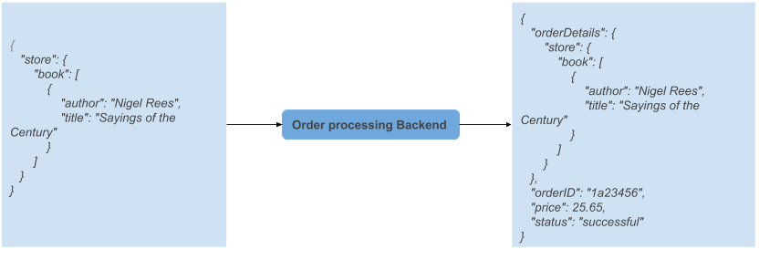
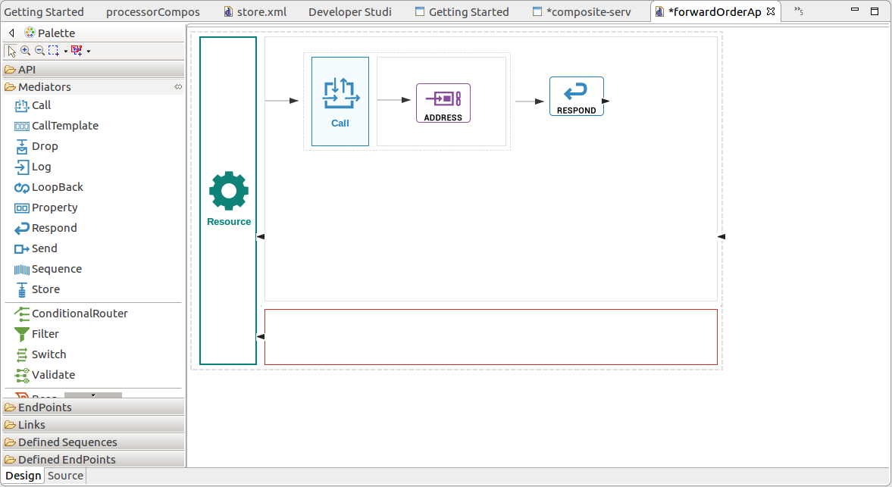

# Sending a Simple Message to a Service Using Micro Integrator

This guide walks you through a sample scenario of invoking a simple backend via Micro Integrator.

Following are the sections available in this guide.

- [What you'll build](#what-you'll-build)
- [Prerequisites](#prerequisites)
- [Implementation](#implementation)
- [Deployment](#deployment)
- [Testing](#testing)

## What You'll Build

During this guide, you will be creating a composite service which, upon invocation will call a that which processes order requests. The following diagram illustrates the use case clearly.


You will be invoking a composite service which wraps the back-end service to process orders. The composite service, upon invocation will forward the request received without any alteration to the back-end service and will forward the response back to the client intact.   

## Prerequisites

- JDK 8
- Maven
- Docker - version 17.09.0-ce or higher
- [Micro Integrator distribution](https://github.com/wso2/micro-integrator)
- [Integrator Tooling Distribution](https://wso2.com/integration/tooling/)

## Implementation

You will be following the below steps in building the scenario:
1. Create the order processing back-end
2. Create the composite service to invoke the back-end

#### 1. Create the order processing back-end
 
The behaviour of the order processing back-end, in a nutshell, is shown below.



It receives order details in a request and and responds by appending the 'orderID', 'price' and 'status' to the order details.

You can build the order process back-end and deploy it in Micro Integrator using the following steps:

1. Build the carbon application for the order process back-end by building the project, 'order-process-be' using maven. Following command,
   ```
   $ cd <mi-work-directory>/examples/getting-started/
   $ mvn clean install
   ```
   will create the file 'order-processCompositeApplication_1.0.0.car' in `order-process-be/order-processCompositeApplication/target` directory.
 
2. Use docker cli to create the docker image with the C-app we created.
(Please note that the distribution must be built with -Ddocker.skip=false prior to this step, for the base image to be created)

    **note:-** If you need to skip the deployment in docker, you can directly deploy the services locally as explained in the section, [Local Deployment.](#local-deployment) 
   ```
   $ docker build -t wso2/mi-order-process-be .
   ```
3. Run the docker image created in the previous step.
   ```
   docker run -d -p 8291:8290 wso2/mi-order-process-be
   ```
   
    If you start the Micro Integrator now, you should be able to access the back-end using the below URL
    ```
    http://localhost:8291/order
    ```

 #### 2. Create the composite service to invoke the back-end
 
 Throughout this section, you will be creating a composite service using WSO2 EI Tool, deploying it in Micro Integrator and running it in Docker. Please follow the below steps to create the composite service.
 
1. [Download and install the EI tool](https://docs.wso2.com/display/EI6xx/Installing+Enterprise+Integrator+Tooling) that is compliant with the distribution.
 
2. Create an ESB solution project as explained [here](https://docs.wso2.com/display/EI6xx/Working+with+EI+Tooling#WorkingwithEITooling-CreatinganESBSolutionProjectCreatinganESBSolutionProject) and name it as 'compositeServiceProject'. Deselect the creation of a 'Registry Project' and a 'Connector Exporter Project' since we will not be needing them for this simple project. 
 
3. Open the project and [create a REST API](https://docs.wso2.com/display/EI6xx/Working+with+EI+Tooling#WorkingwithEITooling-CreatingartifactsforanESBSolutionProject). You can either create an API from scratch and configure it as shown in the following diagram  or directly import the config from [here](composite-service/composite-service/src/main/synapse-config/api/forwardOrderApi.xml).
 
  
 
4. Save the project and export the composite application to a desired location. (Alternatively you can build the project 'composite-service' using maven and the C-App will be located in `composite-service/composite-service-capp/target`. The rest of the document will assume that the C-App resides in `composite-service/composite-service-capp/target`
 
5. Use docker cli to create the docker image with the both back-end and composite service C-Apps we created.

    **note:-** If you need to skip the deployment in docker, you can directly deploy the services locally as explained in the section, [Local Deployment.](#local-deployment) 
   ```
   $ cd <mi-work-directory>/examples/getting-started/composite-service
   $ docker build -t wso2/mi-getting-started .
   ```
6. Run the docker image created in the previous step.
   ```
   docker run -d -p 8290:8290 wso2/mi-getting-started
   ```
## Deployment

Through out this section, it will be assumed that you have a C-app representing the services to be deployed.

#### Local Deployment

Even though the Micro Integrator integrator is specifically designed to be container native, it is possible for you to deploy services and run the Micro Integrator locally. Since it does not support hot deployment of artifacts, it is required for you to start/restart the server after copying the artifacts into the correct location so that the services are available for use.

You would be deploying the 2 services, 'order-process-backend' and the 'composite-service' in 2 different WSO2 Micro Integrator instances. Therefore, it is required have 2 separate distribution of MI. We will be referring to them as MI1 and MI2 in the following sections respectively.

##### Deploying the backend locally

Assume you have followed steps 1-3 in the section, [Create the order processing back-end.](#1-create-the-order-processing-back-end)
   
1. Copy the `order-process-be/order-processCompositeApplication/target/order-processCompositeApplication_1.0.0.car` into `<MI1_HOME>/repository/deployment/server/carbonapps`

2. Start a Micro Integrator instance(MI1) with a [port offset.](../../doc/configuring-port-offset.md) (The reason why we start the server with a port offset is because we will be starting another instance of WSO2MI for the composite service to as explained in the [section below,](#deploying-the-composite-service-locally) leading to a port conflict.)

3. You should be able to access the back-end using the below URL
   ```
   http://localhost:8291/order
   ```
##### Deploying the composite service locally

Assume you have followed steps 1-4 in the section [Create the composite service to invoke the back-end.](#create-the-composite-service-to-invoke-the-back-end) The C-App containing the composite service resides in `composite-service/composite-service-capp/target`.

1. Copy the `composite-service/composite-service-capp/target/composite-serviceCompositeApplication_1.0.0.car` into `<MI2_HOME>/repository/deployment/server/carbonapps`

2. Start the Micro Integrator instance(MI2).

## Testing
#### Verifying the invocation

Invoke the composite service using the following curl command
```
curl --header "Content-Type: application/json" --request POST   --data '{"store": {"book": [{"author": "Nigel Rees","title": "Sayings of the Century"},{"author": "J. R. R. Tolkien","title": "The Lord of the Rings","isbn": "0-395-19395-8"}]}}' http://localhost:8290/forward
```
Upon invocation you should be able to observe the following response
 ```
{
	"orderDetails":{"store": {"book": [{"author": "Nigel Rees","title": "Sayings of the Century"},{"author": "J. R. R. Tolkien","title": "The Lord of the Rings","isbn": "0-395-19395-8"}]}},
	"orderID":"1a23456",
	"price":25.65,
	"status":"successful"
}
```
#### Debugging the mediation

Alternatively, the Integrator Tool brings in the capability of debugging the mediation flow with the the tool interactively. for more information on debugging the mediation flow, please refer to [this blog.](https://medium.com/@rosensilva/debugging-integration-flows-using-wso2-enterprise-integrator-16bc127732d)

## Tracing and Monitoring with Micro Integrator

#### Monitoring Statistics with Prometheus

Please refer the section [Configuring and Monitoring statistics using Prometheus](
../../doc/working-with-the-micro-integrator.md#configuring-and-Monitoring-statistics-using-Prometheus) for more 
information on 
this. 
 